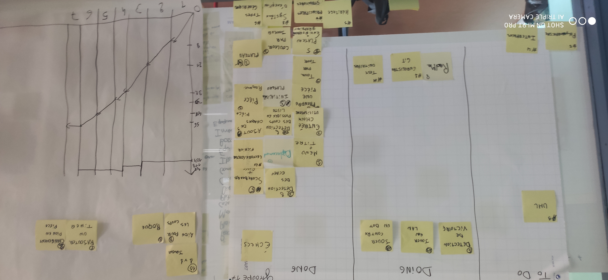

*COLLESSON Baptiste, BELGUEBLI Rayane, COULIOU Ulysse, ENGELAERE Theo, SOULIEZ Gaspard*

Sprint 7
---

## Démo + Planification du sprint suivant

### Ce que nous avons fait durant ce sprint

Lors de ce sprint nous n'avons finalisé aucune tâche. En effet nous manquons de temps pour réaliser ce que nous avions prévu de faire pour ce sprint.

### Ce que nous allons faire durant le prochain sprint

- jouer contre un bot
- jouer en lan
- détection de victoire
- uml
- readme

## Rétrospective

### Sur quoi avons nous butté ?

- le seul problème que nous avons eu lors de ce sprint est que nous manquons de temps pour réaliser les tâches. Nous avions peut-être prévu trop de tâches pour ce sprint.

### PDCA

- Nous allons travailler le problème principal de ce sprint qui est de vouloir trop en faire, ce qui ne résulte d' aucun avancement majeur.
- pour constater l'évolution du problème il faut regarder le nombre de tâches réalisées lors des prochains sprint.
- Pour régler ce problème il y a plusieurs solutions comme prioriser certaines tâches et les faire dans leur ordre d'importance en travaillant tous sur la même tâche car les tâches restantes sont lourdes en travail. Comme autre solution, il y a le fait de faire des groupes qui s'occupent chacun d'une tâche à la fois.
- Nous avons choisi la deuxième solution car nous n'avons plus trop de temps donc nous voulons réaliser un maximum de tâches ce qui est plus simple avec plusieurs groupes qui travaillent sur des tâches différentes.

---

