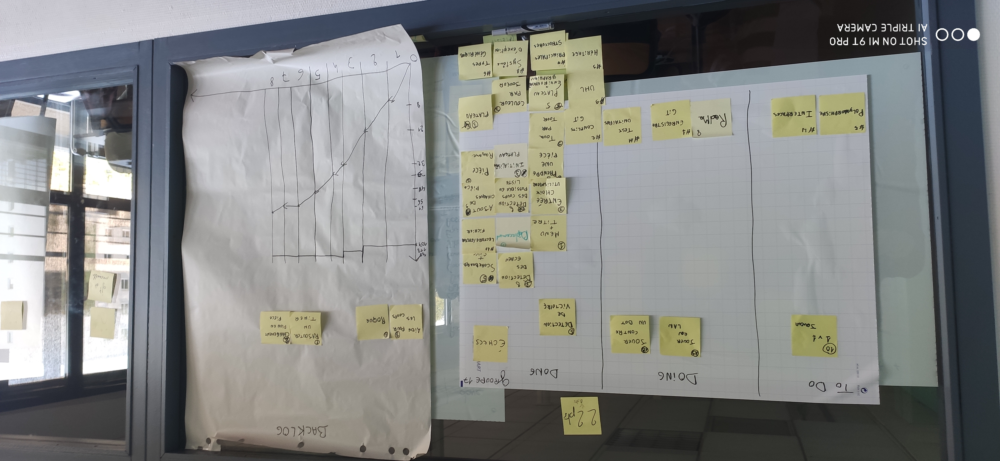

*COLLESSON Baptiste, BELGUEBLI Rayane, COULIOU Ulysse, ENGELAERE Theo, SOULIEZ Gaspard*

Sprint 8
---

## Démo + Planification du sprint suivant

### Ce que nous avons fait durant ce sprint

- détection de victoire

### Ce que nous allons faire durant le prochain sprint

- règle détaillée
- jouer en lan
- 1v1 joueur
- uml
- readme

## Rétrospective

### Sur quoi avons nous butté ?

- le seul problème que nous avons eu lors de ce sprint est que nous avons rencontré beaucoup d'erreur dans le code.

### PDCA

- Nous allons travailler sur le problème ci-dessus.
- pour constater l'évolution du problème il faut regarder le nombre de tâches réalisées lors des prochains sprint.
- Pour régler ce problème nous pouvons réduire le nombre de tâche à faire et travailler sur la résolution de bug avant de commencer de nouvelle tâche.
- Nous avons choisi cette solution car elle nous permettra d'effectuer le plus de tâche possible et qu'elle soit fonctionnelle.

---

