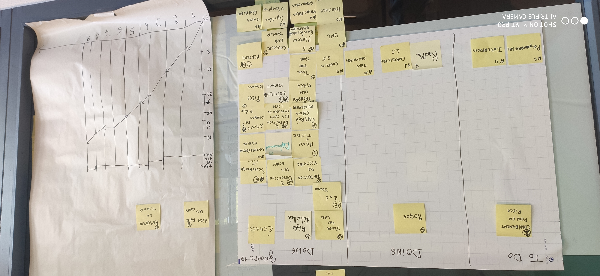

*COLLESSON Baptiste, BELGUEBLI Rayane, COULIOU Ulysse, ENGELAERE Theo, SOULIEZ Gaspard*

Sprint 9
---

## Démo + Planification du sprint suivant

### Ce que nous avons fait durant ce sprint

- règles détaillée
- 1v1 joueur
- jouer en lan

### Ce que nous allons faire durant le prochain sprint

## Rétrospective

### Sur quoi avons nous butté ?

- Nos problèmes dans ce dernier sprint était le manque de temps pour finaliser notre projet.

### PDCA

- Nous devons travailler sur un problème de temps.
- pour constater l'évolution du problème il faut regarder si toutes les tâches sont réalisées à la fin des sprint.
- Pour régler ce problème nous pouvons simplement réduire le nombre de tâches.
- Nous avons choisi cette solution car elle est simple et efficace.

---

